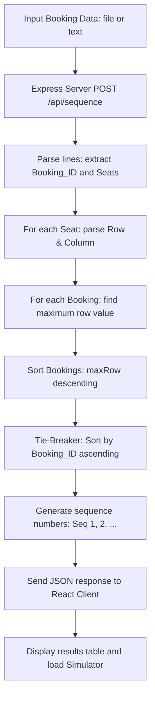
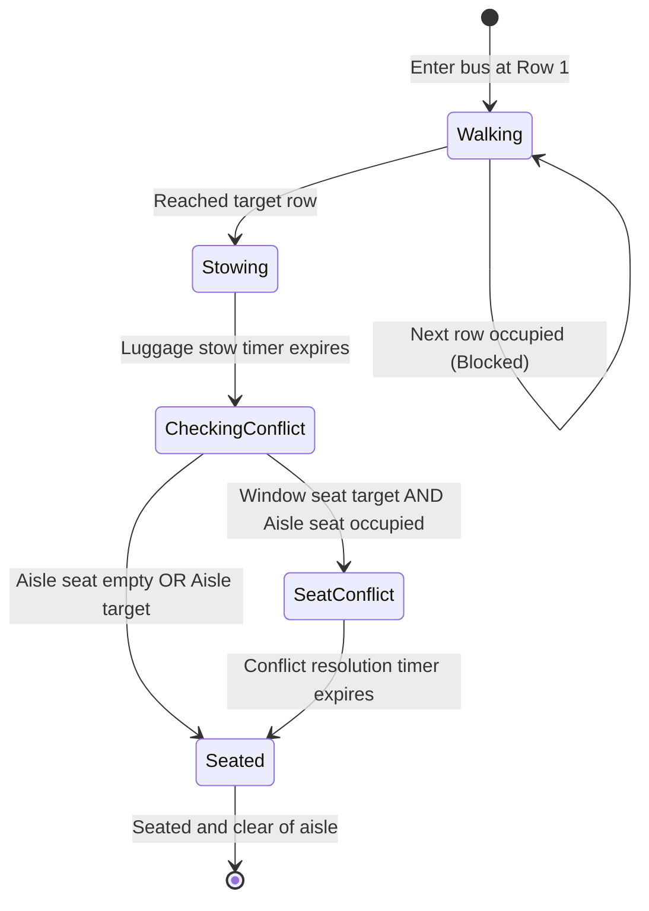

# 🚌 Bus Boarding Sequence Generator

An elegant, interactive full-stack application designed to generate and visualize optimal bus boarding sequences. It uses Node.js (Express) for the optimization engine and React (Vite) for a premium visual boarding simulator.

---

## 📖 The Boarding Problem & Optimization

### Problem Statement
When passengers board a bus from a single front entry, their boarding order determines how much they block each other in the aisle while stowing luggage. If Passenger A has a seat in Row 1 (front) and boards before Passenger B who has a seat in Row 20 (back), Passenger A will stand in the aisle at Row 1 to stow their luggage, blocking Passenger B from reaching the back. This is known as **Aisle Interference**.

Additionally, if Passenger C occupies an aisle seat (B or C) and Passenger D subsequently boards to sit in the adjacent window seat (A or D), Passenger C must step out into the aisle, wait for Passenger D to sit, and then re-seat. This is known as **Seat Interference**.

### The Solution: Back-to-Front Boarding
To minimize boarding time, we implement the **Back-to-Front** boarding sequence:
1. Passengers sitting in the rear of the bus board first.
2. Group bookings board together. For bookings with multiple seats, the boarding priority is determined by their **farthest seat** (maximum row number from the front).
3. If there is a tie (bookings share the same farthest row), the booking with the **earlier Booking ID** (numeric or lexicographical order) is prioritized.

---

## 📊 System Architecture & Flows

### 1. Booking Processing Flow
The following flowchart illustrates how the system receives booking data, parses the seats, and outputs the optimal sequence.



### 2. Passenger Simulation State Machine
The simulator models passenger movement through the aisle and into their seats using the following state transitions:



---

## ⚡ Key Features

- **Optimal Sequence Generator**: Backend API calculates the optimal boarding sequence in milliseconds.
- **Drag & Drop File Uploader**: Quickly upload `.txt`, `.csv`, or `.tsv` files containing booking details.
- **Interactive 2D Bus Visualizer**: Watch passenger avatars walk from the front entry, move down the aisle, stow luggage (yellow glow), and enter their seats.
- **Comparative Analysis Dashboard**: Shows an instantaneous background simulation comparing **Back-to-Front (Optimized)** vs **Front-to-Back (Worst Case)** vs **Random (Input Order)** on Boarding Time, Aisle Blockages, and Seat Interferences.
- **Adjustable Parameters**: Change simulation speed, luggage stow time, seat conflict penalties, and spacing to see how they impact total boarding efficiency.

---

## 🛠️ Installation & Setup

### Prerequisites
- [Node.js](https://nodejs.org/) (v18 or higher recommended)
- `npm` (packaged with Node.js)

### Step 1: Clone or Open the Directory
Ensure you are in the project root directory: `c:\Users\gbcha\Coding\Projects\Assignment`.

### Step 2: Set Up & Run the Backend API
1. Navigate to the backend directory and install dependencies:
   ```bash
   cd backend
   npm install
   ```
2. Start the API server:
   ```bash
   npm start
   ```
   *The backend will run on [http://localhost:5000](http://localhost:5000).*

### Step 3: Set Up & Run the Frontend UI
1. Open a new terminal window, navigate to the frontend directory:
   ```bash
   cd frontend
   ```
2. Run the Vite development server:
   ```bash
   npm run dev
   ```
3. Open your browser and navigate to the local address shown in the terminal (usually [http://localhost:5173](http://localhost:5173)).

---

## 🧪 Running Tests

The backend includes a unit test suite verifying parser correctness, row calculations, and tie-breaker sorting. To run:
```bash
cd backend
npm test
```

---

## 📝 Input File Format Example

The system accepts space, tab, or comma-separated formats. Bookings can have multiple seats separated by commas.

```text
Booking_ID   Seats
101          A1,B1
120          A20,C2
```

### Generated Output:
```text
Seq   Booking_ID
1     120
2     101
```
*(Booking 120 boards first because its seat A20 is at the rear of the bus, whereas Booking 101's farthest seat is Row 1).*
